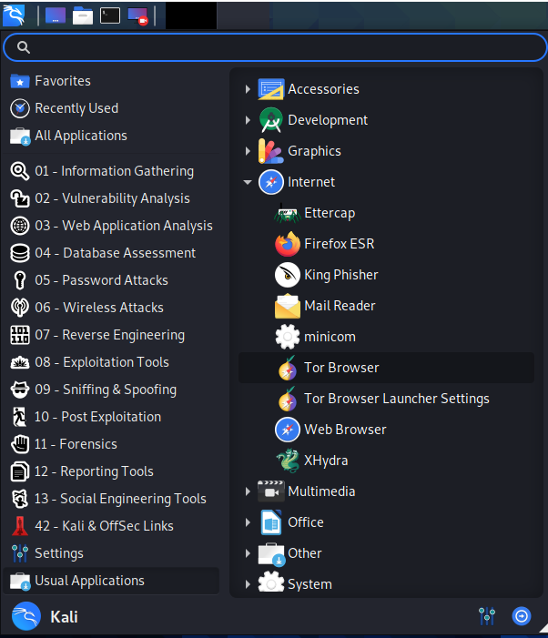

# Reconfiguring-Kali

### What is Kali Linux?

"Kali Linux is a Debian-based Linux distribution geared towards various information security tasks, such as Penetration Testing, Security Research, Computer Forensics and Reverse Engineering." 

* Source: https://www.kali.org/ 
* Download Kali Linux: https://www.kali.org/downloads/
* Tutorial on verifying authenticity of the Kali Linux ISO image: https://technibuzz.com/how-to-verify-integrity-and-authenticity-of-kali-linux-iso-image/ 
* Note: I installed Kali Linux in Vitual Box in Windows 10
* Note: Commands to input into the terminal are `written in this format`. Follow them sequentially

### Operations to perform after installing Kali Linux. 

1. Change the default password 
* Enter `passwd`
* Enter default password `kali`
* Enter you new password and store it somewhere SECURE

2. Install terminal multiplexer tilix
* `sudo apt-get install tilix -y`
* After installation run tilix with `tilix` command 

3. Install Tor onion browser
* `sudo apt-get update`
* `sudo apt-get install tor torbrowser-launcher -y`
* Tor Browser can be found by entering "Tor" in the search browser or in: Usual Applications > Internet > Tor Browser

4. Change default SSH keys
* Navigate to directory storing ssh keys: `cd /etc/ssh`
* Create a directory to store old ssh keys: `sudo mkdir old_keys`
* Move old ssh keys into old ssh keys directory `sudo mv ssh_host_* old_keys`
* Generate new SSH keys: `sudo dpkg-reconfigure openssh-server`
* View newly generated SSH key hashes: `sudo md5sum ssh_host_*`
* View old ssh key hashes: `cd old_keys` `sudo md5sum ssh_host_*`
* Hashes will be different
* Navigate out of the old keys directory `cd ..`
* Delete the old keys directory `sudo rm -r -v old_keys`

5. Enable postgreSQL to start at boot: `sudo systemctl enable postgresql`
* PostgreSQL is an open source relational database system that support SQL relational and JSON non-relational querying  
* More on posgreSQL: https://www.postgresql.org/about/ 

6. Check the installed python packages and switch to python 3
* Note: `alias` can be used to revert back to python3

8. Change default port for SSH from port 22, to something else 

7. Change default US keyboard layout 
* `sudo dpkg-reconfigure keyboard-configuration`
* https://askubuntu.com/questions/342066/how-to-permanently-configure-keyboard

