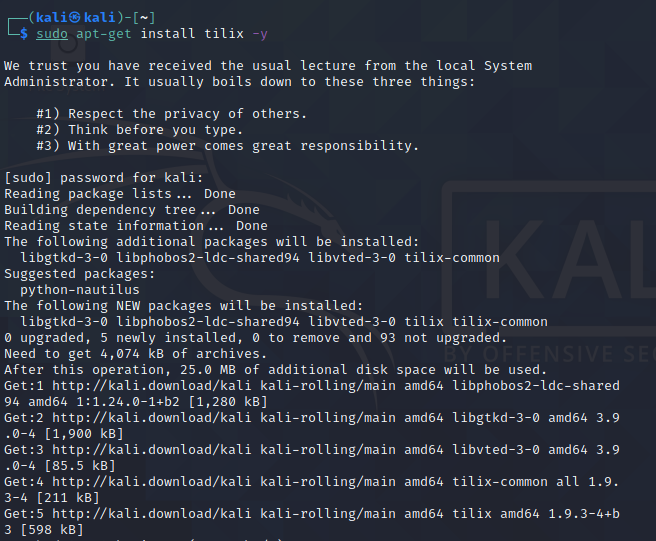

# Reconfiguring-Kali

### What is Kali Linux?

"Kali Linux is a Debian-based Linux distribution geared towards various information security tasks, such as Penetration Testing, Security Research, Computer Forensics and Reverse Engineering." 

* Source: https://www.kali.org/ 
* Download Kali Linux: https://www.kali.org/downloads/
* Tutorial on verifying authenticity of the Kali Linux ISO image: https://technibuzz.com/how-to-verify-integrity-and-authenticity-of-kali-linux-iso-image/ 
* Note: I installed Kali Linux in Vitual Box in Windows 10
* Note: Commands to input into the terminal are `written in this format`. Follow them sequentially

### Operations to perform after installing Kali Linux. 

1. Change the default password 
* Enter `passwd`
* Enter default password `kali`
* Enter you new password and store it somewhere SECURE

2. Install terminal multiplexer tilix
* `sudo apt-get install tilix -y`
* After installation run tilix with `tilix` command 

3. Install Tor onion browser
* `sudo apt-get update`
* `apt-get install tor torbrowser-launcher -y`
* Tor browser application will then be found in the Usual Applications 

4. Change default SSH keys
* Navigate to directory storing ssh keys: `cd /etc/ssh`
* Create a directory to store old ssh keys: `sudo mkdir old_keys && mv ssh_host_* /old_keys`
* Generate new SSH keys: `dpkg-reconfigure openssh-server`
* View newly generated SSH hashes: `md5sum ssh_host_*`
* View old SSH key hashes: `cd /old_keys && md5sum ssh_host_*`
* Hashes should be different so you can proceed to delete the directory storing old keys

5. Change default port for SSH from port 22, to something else 

6. Change default US keyboard layout 
* `sudo dpkg-reconfigure keyboard-configuration`
* https://askubuntu.com/questions/342066/how-to-permanently-configure-keyboard

